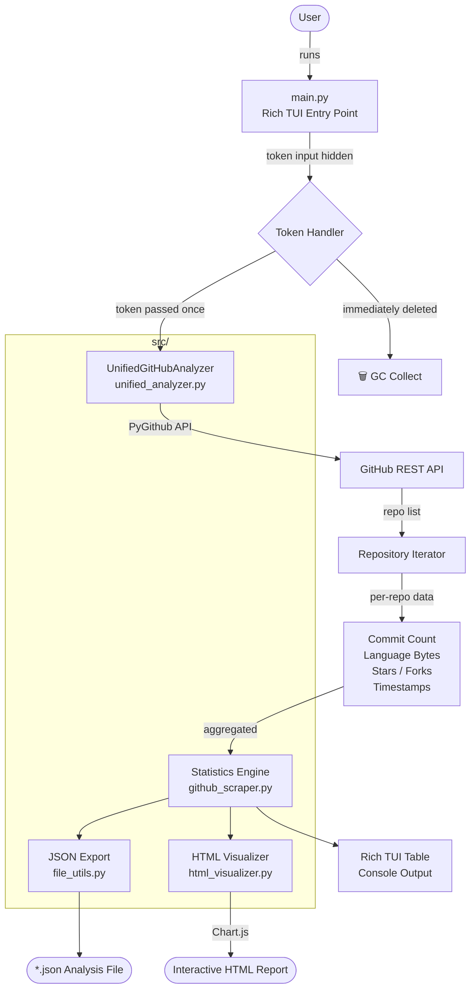
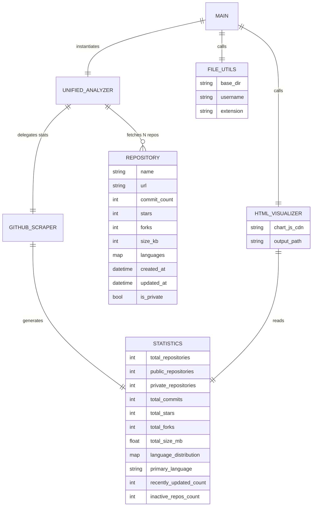

# GitHub Profile Analyzer

> A terminal-based GitHub profile analyzer — scrapes commits, code volume, and language distribution across repos. Outputs rich TUI stats and interactive HTML reports. Packaged as a single `.exe` via PyInstaller.

[](https://www.python.org/)
[](./LICENSE)
[](https://github.com/Textualize/rich)
[](https://pyinstaller.org/)

---

## Overview

**GitHub Profile Analyzer** is a fully self-contained TUI (Terminal UI) tool built with Python and [Rich](https://github.com/Textualize/rich). It authenticates against the GitHub API using a Personal Access Token, analyzes a user's repository portfolio in real-time, and presents the results as an interactive terminal dashboard with an optional Chart.js-powered HTML export.

The tool is designed with **zero token persistence** — your token is accepted via a hidden prompt, used immediately, and purged from memory with forced garbage collection.

---

## Architecture



---

## Data Flow & Module ERD



---

## Features

| Category | Detail |
|---|---|
| **Repository Scope** | Public / Private / All (selectable at runtime) |
| **Stats Collected** | Commits, Stars, Forks, Code size, Language bytes |
| **Language Analysis** | Per-language byte distribution with Top 10 bar |
| **Activity Analysis** | Active (30d / 90d) vs Inactive repo breakdown |
| **Output: Terminal** | Rich-powered table + progress bar |
| **Output: JSON** | Full analysis dump with auto-numbered filenames |
| **Output: HTML** | Interactive Chart.js charts (pie, bar, donut) |
| **Token Security** | Hidden input → immediate use → forced GC deletion |
| **Distribution** | Single `.exe` via PyInstaller (no Python required) |

---

## Quick Start

### Option A — Run the pre-built executable (Windows)

```bash
dist\github-profile-analyzer.exe
```

No Python installation required. Just run and follow the TUI prompts.

### Option B — Run from source

**1. Clone the repository**
```bash
git clone https://github.com/hslcrb/gitscraper.git
cd gitscraper
```

**2. Create and activate a virtual environment**
```bash
# Windows
python -m venv .venv
.venv\Scripts\activate

# macOS / Linux
python3 -m venv .venv
source .venv/bin/activate
```

**3. Install dependencies**
```bash
pip install -r requirements.txt
```

**4. Run the program**
```bash
python main.py
```

---

## Usage

Once launched, the TUI presents a two-option main menu:

```
GitHub Profile Analyzer
Unified Analysis Tool

+--------------------------------- Main Menu ---------------------------------+
| 1 Start Analysis                                                            |
| 0 Exit                                                                      |
+-----------------------------------------------------------------------------+
```

**Analysis flow:**

1. Enter a GitHub username (or paste the full profile URL)
2. Select repository scope: `Public only` / `Private only` / `Both`
3. Enter your GitHub Personal Access Token (hidden input)
4. Token is immediately discarded from memory after handoff to the analyzer
5. Real-time progress bar as each repository is scraped
6. Results table printed to terminal
7. Optionally save as `.json` and/or generate `.html` visualization

### Required Token Scopes

| Scope | Purpose |
|---|---|
| `repo` | Read private repositories |
| `read:user` | Read user profile metadata |

> **Tip:** For public-only analysis, a token with no scopes (or a fine-grained token with public read access) is sufficient.

---

## Project Structure

```
gitscraper/
├── main.py                         # Rich TUI entry point
├── github-profile-analyzer.spec    # PyInstaller build spec (tracked)
├── dist/
│   └── github-profile-analyzer.exe # Compiled single-file executable (tracked)
├── src/
│   ├── __init__.py
│   ├── unified_analyzer.py         # Core: unified Public+Private analysis engine
│   ├── github_scraper.py           # Core: per-repo scraping + statistics generator
│   ├── html_visualizer.py          # Chart.js HTML report generator
│   ├── file_utils.py               # Auto-numbered filename utility
│   ├── github_scraper_cli.py       # Legacy CLI interface
│   ├── advanced_analyzer.py        # Legacy advanced analysis module
│   ├── visualizer.py               # Legacy matplotlib visualizer
│   ├── run_analysis.py             # Legacy batch runner
│   ├── compare_profiles.py         # Legacy profile comparison
│   └── export_report.py            # Legacy report exporter
├── test_basic.py                   # Basic unit + integration tests
├── requirements.txt                # Python dependencies
├── setup.py                        # Package setup (setuptools)
├── run.sh                          # One-click shell launcher (Linux/macOS)
├── example_batch.sh                # Batch analysis example
├── .gitignore
└── LICENSE
```

---

## Security Model

This tool is designed for environments where token leakage is a concern.

```
[User Input] ──(hidden getpass)──► [Token string in RAM]
                                          │
                                          ▼
                              [PyGithub Github(token)]
                                          │
                              [Analyzer object holds ref]
                                          │
                              [del token] ◄─── immediately after handoff
                              [gc.collect()]
                                          │
                              [Analysis completes]
                                          │
                              [analyzer.cleanup()]
                              [del analyzer]
                              [gc.collect()]
```

- ❌ Token is **never written to disk** (no `.env`, no config file)
- ❌ Token is **never logged** to stdout or any file
- ✅ Token is deleted from Python's namespace with `del` immediately after handoff
- ✅ Forced `gc.collect()` is called twice — after token deletion and after analysis
- ✅ Input is hidden via `getpass` (no echo to terminal)

---

## Build from Source (PyInstaller)

To rebuild the `.exe` from source:

```bash
# Install build dependency
pip install pyinstaller

# Build using the tracked spec file
pyinstaller github-profile-analyzer.spec --clean
```

Output: `dist/github-profile-analyzer.exe`

The `.spec` file pins all hidden imports (including `src/` submodules, `rich`, `PyGithub`, `matplotlib`, `numpy`) and bundles the `src/` directory as data. The build is configured as `--onefile` with `--console` mode.

---

## Dependencies

| Package | Version | Purpose |
|---|---|---|
| `requests` | 2.31.0 | HTTP client for API calls |
| `PyGithub` | 2.1.1 | GitHub REST API v3 wrapper |
| `matplotlib` | 3.8.2 | Chart rendering (legacy modules) |
| `numpy` | 1.26.2 | Numerical aggregation |
| `rich` | 13.7.0 | Terminal UI rendering |
| `python-dotenv` | latest | `.env` loader for test environment |

---

## Testing

```bash
# Run with UTF-8 output (required on Windows)
$env:PYTHONUTF8=1; $env:PYTHONPATH="src"; python test_basic.py
```

Tests run without a `GITHUB_TOKEN` by skipping API-dependent cases and using dummy tokens for initialization smoke tests. All 5 tests pass in a token-free environment.

---

## License

[MIT](./LICENSE) © hslcrb
